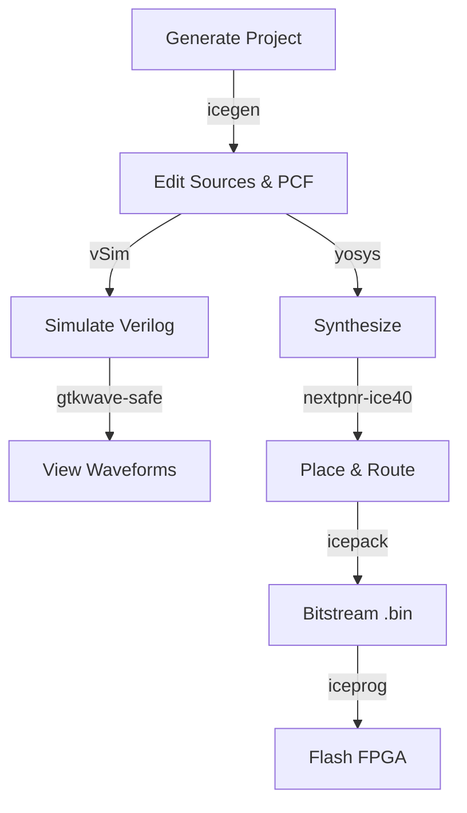

---

# 🧊 FPGA Tools Repo

This repo provides helper scripts and wrappers to simplify **Lattice iCE40 FPGA** development using the **OSS CAD Suite** toolchain and **CMake**.

---

## 📂 Contents

* `fpga_env.sh` → Activates OSS CAD Suite environment
* `gtk_wave.sh` → Safe GTKWave launcher (avoids GLIBC conflicts)
* `icegen` → Project generator (creates CMake + Verilog skeleton)
* `vSimBuild.sh` → Verilog simulation wrapper (iverilog + vvp)
* `install-tools.sh` → Installer (installs dependencies, sets permissions, and creates symlinks)

---

## 📦 Dependencies

These scripts rely on the following **open-source tools**:

* [OSS CAD Suite](https://github.com/YosysHQ/oss-cad-suite-build) → `yosys`, `nextpnr-ice40`, `icepack`, `iceprog`
* [iverilog](http://iverilog.icarus.com/) → Verilog compiler
* [vvp](http://iverilog.icarus.com/) → Verilog runtime
* [GTKWave](http://gtkwave.sourceforge.net/) → waveform viewer
* [CMake](https://cmake.org/) → build automation

System dependencies (Ubuntu/Debian):

```bash
sudo apt update
sudo apt install -y build-essential cmake git iverilog gtkwave libftdi1-2 libusb-1.0-0
```

---

## 🛠 Install OSS CAD Suite

Example for **macOS (Apple Silicon, ARM64)** — adjust filename for your platform:

```bash
mkdir /repo/<user-name>/Compiler
curl -LO https://github.com/YosysHQ/oss-cad-suite-build/releases/download/2025-08-31/oss-cad-suite-darwin-arm64-20250831.tgz
tar -xvzf oss-cad-suite-darwin-arm64-20250831.tgz
mv oss-cad-suite-darwin-arm64-20250831 oss-cad-suite
source fpga-env
```

Reload and test:

```bash
yosys --version
nextpnr-ice40 --version
```

⚡ OSS CAD Suite is portable — just unpack it and add it to `PATH`.

---

## ⚙️ Installation

Run:

```bash
bash install-tools.sh
```

This will:

* Install required system dependencies
* Lock down script permissions (`r-xr-xr-x`)
* Create symlinks in `/usr/bin`
* Check for required OSS CAD Suite tools (`yosys`, `nextpnr-ice40`, `icepack`, `iceprog`)

---

## 🚀 Usage

Activate toolchain:

```bash
source fpga-env
```

Generate project:

```bash
icegen -p blink -t sample -d up5k
```

Build & flash:

```bash
cd blink/build
cmake ..
cmake --build . --target fpga -j4
cmake --build . --target flash
```

Simulate (always run testbench file):

```bash
vSim sim.out gateware/tb_top.v
```

View waves:

```bash
gtkwave-safe waveform.vcd
```

---

## 🔄 Quickstart Flow



---

## 📝 Quick Notes

* Edit `<top>.pcf` for your FPGA board pin mappings.
* Run `source fpga-env` in each new shell before building.
* Re-run `install-tools.sh` anytime to refresh symlinks.
* If OSS CAD Suite tools are missing, the installer shows a warning.

---

